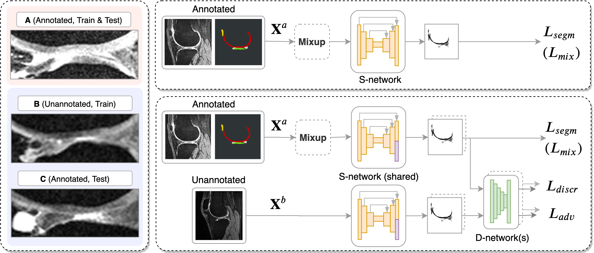

# rocaseg - Robust Cartilage Segmentation from MRI

Source code for Panfilov et al. "Improving Robustness of Deep Learning Based Knee MRI Segmentation: Mixup and Adversarial Domain Adaptation", https://arxiv.org/abs/1908.04126v3.

<p align="center">
 
</p>

### Important!

The camera-ready version contained a bug in Dice score computation for tibial cartilage on Dataset C. Please, refer to the arXiv version for the corrected values - https://arxiv.org/abs/1908.04126v3.

### Description

1. To reproduce the experiments from the article one needs to have access to
 OAI iMorphics, OKOA, and MAKNEE datasets.

2. Download code from this repository.
 
3. Create a fresh Conda environment using `environment.yml`. Install the downloaded
 code as a Python module.

4. `datasets/prepare_dataset_...` files show how the raw data is converted into the
 format supported by the training and the inference pipelines.
 
5. The structure of the project has to be as follows:
    ```
    ./project/
        | ./data_raw/  # raw scans and annotations
             | ./OAI_iMorphics_scans/
             | ./OAI_iMorphics_annotations/
             | ./OKOA/
             | ./MAKNEE/
        | ./data/  # preprocessed scans and annotations
        | ./src/ (this repository)
        | ./results/  # models' weights, intermediate and final results 
             | ./0_baseline/
                  | ./weights/
                  | ...
             | ./1_mixup/
             | ./2_mixup_nowd/
             | ./3_uda1/
             | ./4_uda2/
             | ./5_uda1_mixup_nowd/
    ```

6. File `scripts/runner.sh` contains the complete description of the workflow.

7. Statistical testing is implemented in `notebooks/Statistical_tests.ipynb`.

8. Pretrained models are available at https://drive.google.com/open?id=1f-gZ2wCf55OVjgA8oXd7xttGVW5DUUcU .

### Legal aspects

This code is freely available only for research purposes.

The software has not been certified as a medical device and, therefore, must not be used
for diagnostic purposes. 

Commercial use of the provided code and the pre-trained models is strictly prohibited,
since they were developed using the medical datasets under restrictive licenses.   

### Cite this work

```
@InProceedings{Panfilov_2019_ICCV_Workshops,
  author = {Panfilov, Egor and Tiulpin, Aleksei and Klein, Stefan and Nieminen, Miika T. and Saarakkala, Simo},
  title = {Improving Robustness of Deep Learning Based Knee MRI Segmentation: Mixup and Adversarial Domain Adaptation},
  booktitle = {The IEEE International Conference on Computer Vision (ICCV) Workshops},
  month = {Oct},
  year = {2019}
}
```
